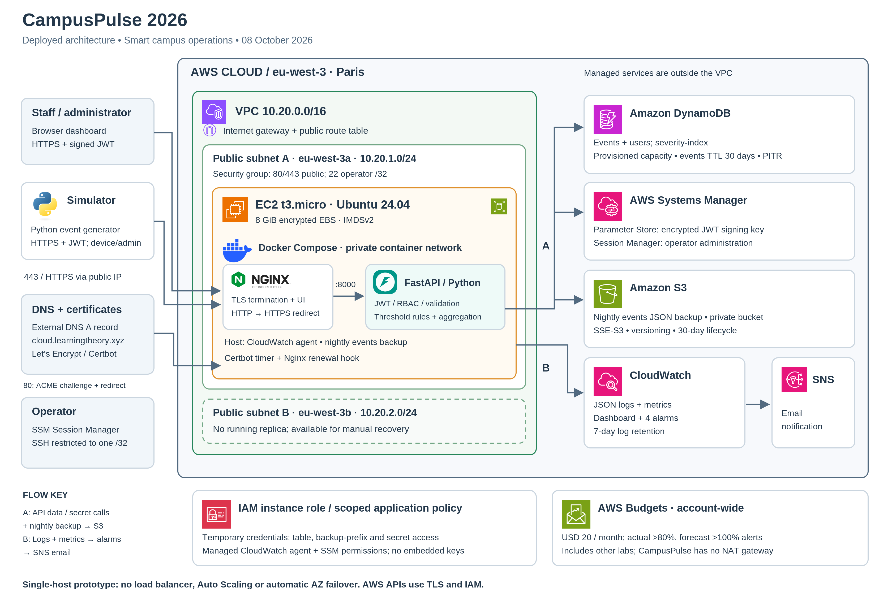
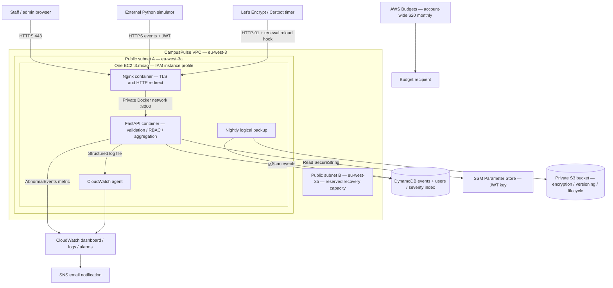

# Architecture

Download the [vector PDF](images/CampusPulse-Architecture.pdf) or [editable SVG](images/CampusPulse-Architecture.svg). [Artwork sources](images/SOURCES.txt) identify the official AWS and technology assets. The diagram describes the deployment observed on October 8, 2026.

## Text diagram

The internet gateway and public route table provide access to subnet A. Its security group permits public HTTP/HTTPS and SSH from the recorded operator IPv4 /32. The API container publishes no host port. Session Manager uses the SSM agent and instance-role permissions for administration. Host credentials come from IMDSv2, with hop limit 2 for container access to the instance role.

Nginx terminates TLS and passes API requests to FastAPI. Authentication checks salted password hashes in the users table; signed JWTs expire after 60 minutes. Staff can read events/statistics, device identities can ingest, and administrators can ingest and view operational alerts. Secrets are fetched from Parameter Store and cached in memory, not committed to Git. DynamoDB and S3 use managed encryption at rest; AWS API calls use TLS.

The instance role scopes the application policy to the project tables, backup prefix and signing-key parameter. Managed CloudWatch and SSM policies provide broader agent capabilities. The application role can write users as required by initial seeding/reset; separating account administration from the runtime role is a production hardening opportunity.

## Availability, scaling and recovery

Only one host is deployed. Two subnets do **not** imply two running replicas or automatic failover. Docker restart policies handle process exits; a failing-but-running process is marked unhealthy but is not automatically restarted by plain Docker Compose. An operator must recover a failed instance. Data lives outside the EC2 host; users, events, the signing parameter and backups must be retained for recovery.

The backend stores shared state in DynamoDB. Future scale-out needs a load balancer and replicated compute, consistent signing-key access, certificate handling and updated deployment/monitoring. `/stats` scans records and caps pagination at approximately 5,000 items, so it is not a complete analytics engine at large scale. `/events` without a building filter scans a bounded subset and does not guarantee the globally latest events in a large table. Pre-aggregation and indexed access patterns are future work.

Nightly S3 dumps supplement PITR. The observed 14.9-second restore copied 513 records into an already created scratch table; instance replacement, table/index creation, traffic cutover and end-to-end application recovery were outside that timing. Backup freshness determines the actual recovery point. The demonstrated S3 backup covers events; user-table backup and broader regional recovery need additional planning.

## Cost boundary

This VPC has no NAT gateway. The separately observed `nat-private` belongs to Lab 3's MyVPC1 and is outside CampusPulse. The demonstrated budget has no project-only cost filter, so its numbers cover other coursework too. Credits offset payable charges without eliminating resource consumption. Pricing estimates and current credit eligibility belong in the final report, not assumptions that every service is free.
